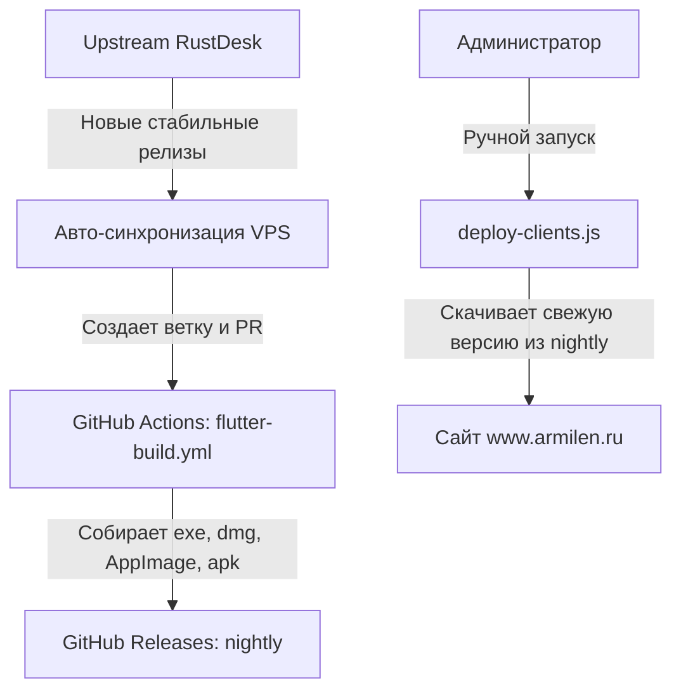

# Armilen Remote (Кастомный клиент RustDesk)

Репозиторий содержит форк официального клиента **RustDesk**, брендированный для ИТ-студии **ARMILEN** (https://www.armilen.ru). Клиент собран с предустановленными настройками для автоматического подключения к нашей инфраструктуре.

## Особенности сборки (Armilen Remote)

1. **Кастомный брендинг**: изменены логотипы, иконки, название приложения на «Armilen Remote», добавлено упрощённое лицензионное соглашение.
2. **Предустановленный сервер**: клиент по умолчанию настроен на подключение к собственному сигнальному (`hbbs`) и релейному (`hbbr`) серверам ARMILEN, прописаны серверные ключи.
3. **Безопасность**:
   - Отключены стандартные функции регистрации, входа и синхронизации адресной книги RustDesk через публичный сервер, чтобы исключить утечки данных и использование сторонних учётных записей.
   - Ссылки на политику конфиденциальности перенаправлены на внутренний адрес `/remote-privacy`.
4. **Собственный механизм обновлений**: клиент делает запрос обновлений к нашему API `https://www.armilen.ru/api/version-check`, сопоставляя версию со сборками, загруженными в директорию `downloads` веб-сервера.

---

## Архитектура автоматизации

Сборка и развертывание клиентов состоят из трёх основных компонентов:



### 1. Автоматическая синхронизация с Upstream (`scripts/sync-upstream/`)
На сервере VPS раз в сутки запускается systemd-таймер `rustdesk-sync-upstream.timer`, выполняющий скрипт `sync-upstream.mjs`.
* **Скрипт**:
  1. Опрашивает официальный репозиторий RustDesk на наличие новых стабильных тегов (например, `1.4.9`).
  2. Если обнаружен новый тег, создаёт локальную ветку `sync/upstream-<версия>` в каталоге `/opt/rustdesk-fork`.
  3. Делает попытку автоматического слияния (`git merge`) upstream-тега с веткой `master`.
  4. При чистом слиянии отправляет ветку на GitHub, создаёт Pull Request и запускает сборочный workflow `flutter-build.yml` на этой ветке.
  5. В случае конфликтов отменяет слияние и отправляет оповещение администратору в Telegram-бот.

### 2. Сборка клиентов (CI/CD)
Сборка выполняется средствами GitHub Actions с использованием файла конфигурации `.github/workflows/flutter-build.yml`.
* Собираются пакеты для всех целевых платформ: **Windows** (`.exe`), **macOS** (`.dmg`), **Linux** (`.AppImage`) и **Android** (универсальный `.apk`).
* Готовые сборки публикуются на странице релизов репозитория под скользящим тегом `nightly`.
* По окончании сборки workflow отправляет уведомление в Telegram-канал администрирования со специальным вебхуком для запуска деплоя.

### 3. Развёртывание на сайт (`deploy-clients.js`)
Скрипт деплоя находится в репозитории сайта (`armilen-site/scripts/deploy-clients.js`) и запускается вручную на VPS для загрузки свежих клиентов с GitHub в статический каталог сайта:
```sh
cd /opt/armilen-site
node scripts/deploy-clients.js
```

Скрипт работает по принципу **Blue-green deployment**: скачивает все бинарники во временные файлы `.tmp` рядом с рабочими, проверяет их размеры, и только при 100% успехе всех загрузок атомарно заменяет файлы в `/srv/www.armilen.ru/downloads/`. Также скрипт автоматически обновляет номер версии в базе данных `db.sqlite3` сервера `rustdesk-api` для информирования установленных клиентов.

---

## Инструкции для разработчика и оператора

### Ручной запуск синхронизации с Upstream
Выполняется на VPS:
```sh
# Базовый запуск (записывает baseline при первом запуске):
REPO_DIR=/opt/rustdesk-fork node scripts/sync-upstream/sync-upstream.mjs

# Принудительная синхронизация последней версии:
REPO_DIR=/opt/rustdesk-fork node scripts/sync-upstream/sync-upstream.mjs --force
```

### Настройки окружения синхронизации
Файл с переменными окружения находится на VPS по адресу `/etc/armilen/rustdesk-sync.env`:
* `GH_TOKEN` — GitHub Personal Access Token с правами на запись контента и работу с workflow.
* `TG_BOT_TOKEN` — Токен Telegram-бота для уведомлений.
* `TG_CHAT_ID` — ID чата для уведомлений.
* `HTTPS_PROXY` — Прокси для отправки сообщений в Telegram (если применимо).
