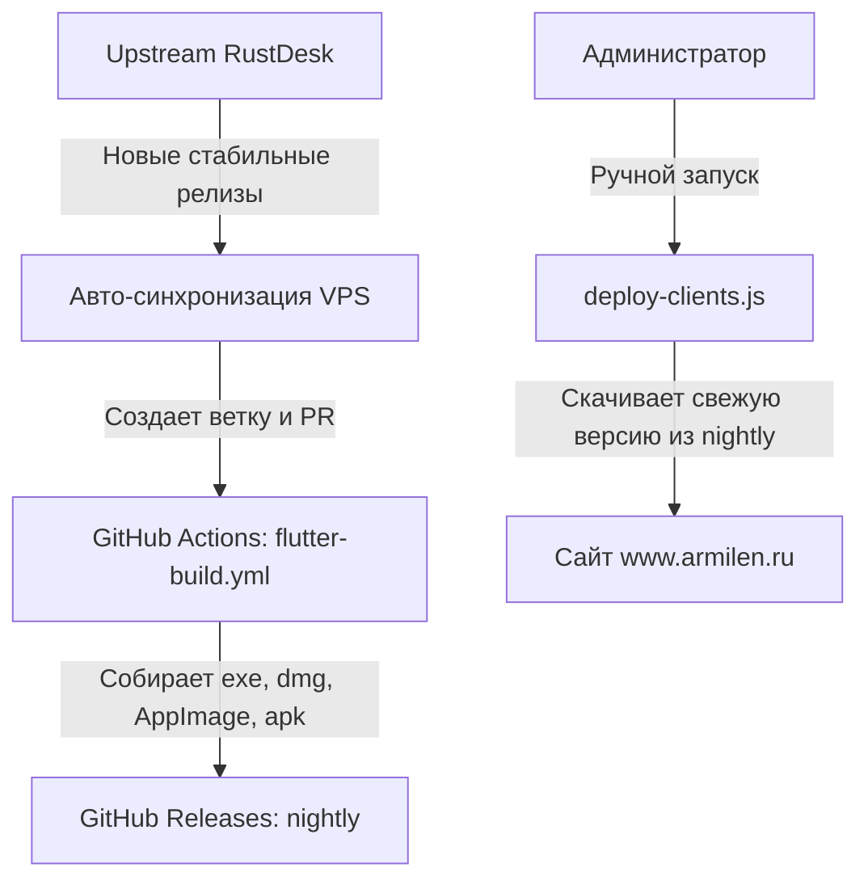

# Armilen Remote (Кастомный клиент RustDesk)

Репозиторий содержит форк официального клиента **RustDesk**, брендированный для ИТ-студии **ARMILEN** (https://www.armilen.ru). Клиент собран с предустановленными настройками для автоматического подключения к нашей инфраструктуре.

## Особенности сборки (Armilen Remote)

1. **Кастомный брендинг**: изменены логотипы, иконки, название приложения на «Armilen Remote», добавлено упрощённое лицензионное соглашение. Акцентный цвет интерфейса совпадает с сайтом: green-700 `#15803D` на светлой теме, green-500 `#22C55E` на тёмной.
2. **Предустановленный сервер**: клиент по умолчанию настроен на подключение к собственному сигнальному (`hbbs`) и релейному (`hbbr`) серверам ARMILEN, прописаны серверные ключи.
3. **Безопасность**:
   - Отключены стандартные функции регистрации, входа и синхронизации адресной книги RustDesk через публичный сервер, чтобы исключить утечки данных и использование сторонних учётных записей.
   - Ссылки на политику конфиденциальности ведут на `https://www.armilen.ru/legal/remote-privacy`.
4. **Собственный механизм обновлений**: см. раздел «Обновление клиентов» ниже.

---

## Иконки и логотипы

Единственный источник — SVG в `scripts/branding/src/`, всё остальное генерируется:

```sh
SHARP_FROM=/home/profax/armilen-site/node_modules node scripts/branding/generate.mjs
```

Скрипт идемпотентный, перезапускается после любой правки исходных SVG и пишет
Windows `.ico`, macOS `.icns`, мипмапы Android (включая цвет фона adaptive-иконки),
логотипы внутри Flutter и набор `res/*.png` для Linux.

| Файл | Куда идёт |
| --- | --- |
| `tile-dark.svg` | канонический тайл: Windows `.ico`, лаунчер Android, `res/*`, `flutter/assets/icon.*` |
| `tile-round.svg` | круглая маска лаунчера Android (`ic_launcher_round`) |
| `tile-macos.svg` | `.icns` с полями по HIG (тайл 412 из 512) |
| `foreground.svg` | передний слой adaptive-иконки Android, он же monochrome |
| `glyph-mono.svg` | иконка статус-бара Android и трей macOS |
| `logo-light.svg` / `logo-dark.svg` | логотипы внутри приложения, прозрачный фон |

Тайл повторяет аватарку группы Telegram (`armilen-site/branding/telegram/workspace-group.svg`):
плоское поле green-700, тёмно-синий промпт, белый курсор. Скругление `rx=96`
у `tile-dark.svg` обязательно: кадры `.ico` Windows рисует как есть, ничем их не
маскируя, поэтому квадратный исходник даст квадратную иконку в проводнике,
на панели задач и в инсталляторе.

---

## Обновление клиентов

Версию клиент узнаёт из `https://www.armilen.ru/api/version-check`: эндпойнт
возвращает `{"url": "https://www.armilen.ru/api/download/<версия>"}`, а клиент
берёт последний сегмент пути как номер версии и сравнивает со своим
(`do_check_software_update` в `src/common.rs`). Версию в `.deploy-state.json`
пишет `deploy-clients.js` при выкладке сборок.

Обновиться можно тремя путями, все ведут в один и тот же `platform::update_me`:

1. **Кнопка «Update» в приложении** (Windows/macOS, клиент установлен). Скачивает
   сборку и перезапускает её с `--update`. Имя ассета клиент составляет сам по
   схеме апстрима (`rustdesk-<версия>-<арх>.exe`), поэтому
   `/api/download/<версия>/<файл>` на сервере редиректит на стабильное имя в
   `/downloads` (`server/rustdesk-server.ts` в репозитории сайта).
2. **Ручное скачивание с `https://www.armilen.ru/support`**. Если запустить свежий
   `.exe` рядом с установленной старой версией, клиент обновляет установку на
   месте сам (`upgrade_installed_copy_if_newer` в `src/core_main.rs`) и просит UAC.
   Без этого одиночный экземпляр Flutter-раннера просто поднимал окно уже
   запущенной старой копии, и выглядело это как «скачал новую, запустилась старая».
   Отказаться можно ключом `--noinstall`.
3. **Автообновление** (`allow-auto-update`, «Auto update» в настройках). Раз в
   сутки, только на установленном Windows-клиенте и только когда нет активных
   сессий. По умолчанию выключено апстримом, включается на машине вручную.

---

## Архитектура автоматизации

Сборка и развертывание клиентов состоят из трёх основных компонентов:


```mermaid
graph TD
    A[Upstream RustDesk] -- Новые стабильные релизы --> B[Авто-синхронизация VPS]
    B -- Создает ветку и PR --> C[GitHub Actions: flutter-build.yml]
    C -- Собирает exe, dmg, AppImage, apk --> D[GitHub Releases: nightly]
    E[Администратор] -- Ручной запуск --> F[deploy-clients.js]
    F -- Скачивает свежую версию из nightly --> G[Сайт www.armilen.ru]
```

### 1. Автоматическая синхронизация с Upstream (`scripts/sync-upstream/`)
На сервере VPS раз в сутки запускается systemd-таймер `rustdesk-sync-upstream.timer`, выполняющий скрипт `sync-upstream.mjs`.
* **Скрипт**:
  1. Опрашивает официальный репозиторий RustDesk на наличие новых стабильных тегов (например, `1.4.9`).
  2. Если обнаружен новый тег, создаёт локальную ветку `sync/upstream-<версия>` в каталоге `/opt/rustdesk-fork`.
  3. Делает попытку автоматического слияния (`git merge`) upstream-тега с веткой `master`.
  4. При чистом слиянии отправляет ветку на GitHub, создаёт Pull Request и запускает сборочный workflow `flutter-build.yml` на этой ветке.
  5. В случае конфликтов отменяет слияние и отправляет оповещение администратору в Telegram-бот.

### 2. Сборка клиентов (CI/CD)
Сборка выполняется средствами GitHub Actions с использованием файла конфигурации `.github/workflows/flutter-build.yml`.
* Собираются пакеты для всех целевых платформ: **Windows** (`.exe`), **macOS** (`.dmg`), **Linux** (`.AppImage`) и **Android** (универсальный `.apk`).
* Готовые сборки публикуются на странице релизов репозитория под скользящим тегом `nightly`.
* По окончании сборки workflow отправляет уведомление в Telegram-канал администрирования со специальным вебхуком для запуска деплоя.

### 3. Развёртывание на сайт (`deploy-clients.js`)
Скрипт деплоя находится в репозитории сайта (`armilen-site/scripts/deploy-clients.js`) и запускается вручную на VPS для загрузки свежих клиентов с GitHub в статический каталог сайта:
```sh
cd /opt/armilen-site
node scripts/deploy-clients.js
```

Скрипт работает по принципу **Blue-green deployment**: скачивает все бинарники во временные файлы `.tmp` рядом с рабочими, проверяет их размеры, и только при 100% успехе всех загрузок атомарно заменяет файлы в `/srv/www.armilen.ru/downloads/`. Также скрипт автоматически обновляет номер версии в базе данных `db.sqlite3` сервера `rustdesk-api` для информирования установленных клиентов.

---

## Инструкции для разработчика и оператора

### Ручной запуск синхронизации с Upstream
Выполняется на VPS:
```sh
# Базовый запуск (записывает baseline при первом запуске):
REPO_DIR=/opt/rustdesk-fork node scripts/sync-upstream/sync-upstream.mjs

# Принудительная синхронизация последней версии:
REPO_DIR=/opt/rustdesk-fork node scripts/sync-upstream/sync-upstream.mjs --force
```

### Настройки окружения синхронизации
Файл с переменными окружения находится на VPS по адресу `/etc/armilen/rustdesk-sync.env`:
* `GH_TOKEN` — GitHub Personal Access Token с правами на запись контента и работу с workflow.
* `TG_BOT_TOKEN` — Токен Telegram-бота для уведомлений.
* `TG_CHAT_ID` — ID чата для уведомлений.
* `HTTPS_PROXY` — Прокси для отправки сообщений в Telegram (если применимо).
